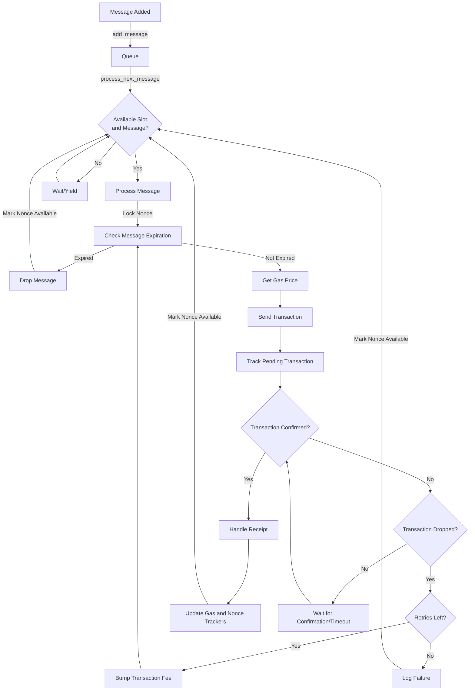

## Sender

```mermaid
graph TD
    A[Message Added] -->|add_message| B[Queue]
    B -->|process_next_message| C{"Available Slot\nand Message?"}
    C -->|Yes| D[Process Message]
    C -->|No| E[Wait/Yield]
    E --> C
    D -->|Lock Nonce| F[Check Message Expiration]
    F -->|Expired| G[Drop Message]
    G -->|Mark Nonce Available| C
    F -->|Not Expired| H[Get Gas Price]
    H --> I[Send Transaction]
    I --> J[Track Pending Transaction]
    J --> K{Transaction Confirmed?}
    K -->|Yes| L[Handle Receipt]
    K -->|No| M{Transaction Dropped?}
    M -->|Yes| N{Retries Left?}
    N -->|Yes| O[Bump Transaction Fee]
    O --> F
    N -->|No| P[Log Failure]
    P -->|Mark Nonce Available| C
    L --> Q[Update Gas and Nonce Trackers]
    Q -->|Mark Nonce Available| C
    M -->|No| R[Wait for Confirmation/Timeout]
    R --> K
```
